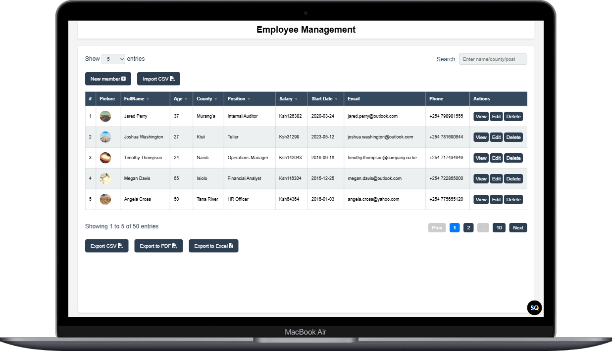

# Employee Management CRUD
A responsive, interactive, and modern web application built with **Vanilla JavaScript**, **HTML5**, and **CSS3** to manage employee records with features like CRUD operations, data import/export, sorting, filtering, pagination, and responsive card views.

---

## 📍 Live Demo
<a href="https://paulmagadi.github.io/Employee-management-CRUD/" target="_blank" rel="noopener noreferrer">Live Demo</a>

---

## 🚀 Features

✅ Add, Edit, View, and Delete Employees  
✅ Import Employee Data from CSV with Image URLs  
✅ Export Filtered Employees to PDF  
✅ Export All Employees to Excel  
✅ Toggleable Table and Card Views (Responsive)  
✅ Column Sorting with Asc/Desc Toggle  
✅ Pagination with Ellipsis Control  
✅ Keyboard Navigation Support  
✅ Auto-Numbered Records  
✅ Data Persistence via `localStorage`  
✅ Smooth Scroll and Clean UI  

---

## 📸 Screenshots



---

## 🛠️ Technologies Used

- **HTML5**
- **CSS3**
- **Vanilla JavaScript**
- `FileReader API` – for CSV import  
- `jsPDF` + `html2canvas` – for PDF export  
- `xlsx.js` – for Excel export  

---

## 📂 File Structure

```
paulmagadi/Employee-management-CRUD/
|
├── index.html
├── main.css
├── main.js
├── employees.csv # Sample CSV file
└── README.md
```

---

## 📦 Getting Started

1. Clone the repository:
```bash
git clone https://github.com/paulmagadi/Employee-management-CRUD.git
cd Employee-management-CRUD
```

2. Open index.html in your browser.

✅ No installation required — runs entirely in the browser.

## 📤 CSV Format for Import
The first row should contain headers like:

`name,age,county,position,salary,startDate,email,phone,imageUrl`

Each row represents one employee. Image URLs should be absolute or relative paths.

## 🔒 License
This project is open-source and available under the MIT License.

## 🙌 Acknowledgments
- jsPDF
- html2canvas
- SheetJS
- Font Awesome

---

## 🧑‍💻 Author
Paul Magadi - [paulmagadi](https://github.com/paulmagadi)

[LinkedIn](https://www.linkedin.com/in/paulmagadi) 

[Portfolio](https://paulmagadi.github.io)